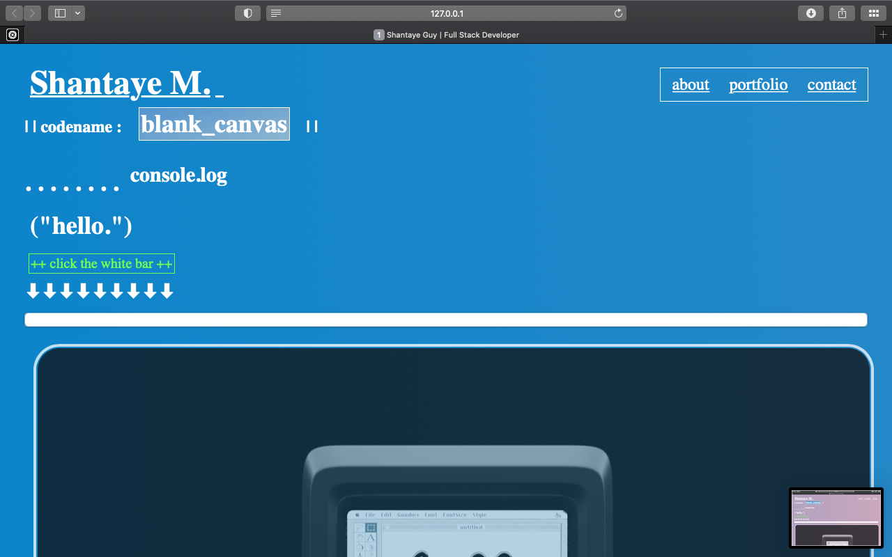

<h1>Shantaye Guy</h1>

First attempt at a professional portfolio.
<h2>General Information</h2>

<ul>
<li>This is the beginning works of my professional portfolio.</li>
</ul><ul>
<li>The problem solved here is future employers are able to locate and review samples of my work, to assess whether I am a good candidate for an open position.</li>
</ul><ul>
<li>The purpose of this project is to showcase the skills that I've learned thus far in my web development bootcamp.</li>
</ul><h2>Technologies Used</h2>

<ul>
<li>HTML</li>
</ul><ul>
<li>JavaScript</li>
</ul><h2>Setup</h2>

This is a read only document therefore no downloading is necessary.
<h2>Usage</h2>

This document is intended to be used to review samples of my work and contact me if you are interested in utilizing my services.
<h2>Project Status</h2>

This project is a work in progress, over the next several months I will continue to update it as I learn new techniques in class.
<h2>Improvements</h2>

<ul>
<li>More links to web applications will be added as I complete them.</li>
</ul><h2>Features that can be added</h2>

<ul>
<li>As the new web applications are being added,I will also add new screenshots.</li>
</ul><h2>Acknowledgement</h2>

<ul>
<li>This project was inspired by my instructors as well as my husband and children!</li>
</ul><ul>
<li>Many thanks to everyone that inspired me to continue learning no matter how challenging these syntaxes may get.</li>
</ul><h2>Contact</h2>

